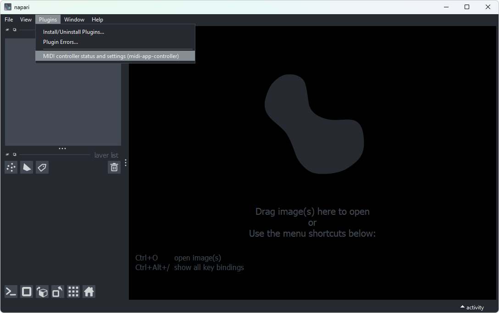
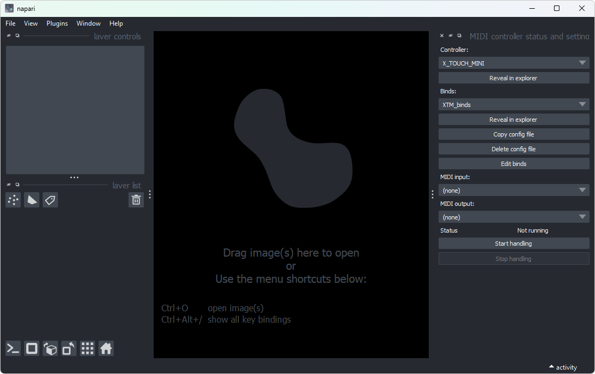
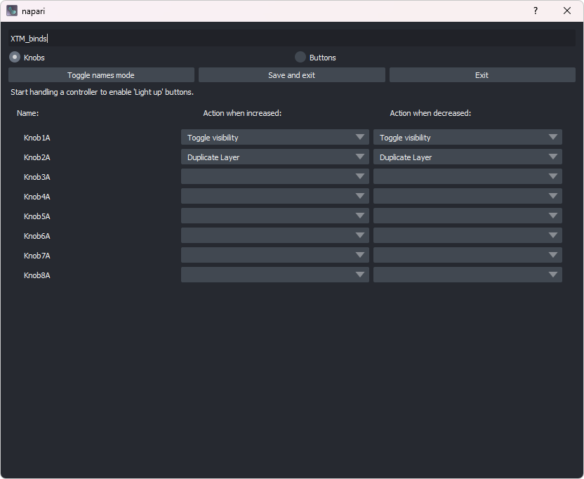

# Getting started (napari)

MIDI App Controller is a package designed to integrate MIDI controllers with Python Qt apps using app-model. As of now, it is used most commonly with [napari](napari.org), a viewer for multi-dimensional images. We will show how to use MIDI App Controller with napari but getting started with other applications should look very similar.

## Installation

To install MIDI App Controller in your environment (where Python and napari are already installed), use this command:

(TODO: This doesn't work as the package is not yet published)

```
pip install midi-app-controller
```

napari will automatically detect the package and install the plugin next time it starts.


### Development version

To install the newest development version, clone the GitHub repo and install it as a local package:

```
git clone https://github.com/midi-app-controller/midi-app-controller/
cd midi-app-controller
python3 -m pip install -e .
napari
```

## Setup

Launch the plugin from the _Plugins_ menu.



A panel will open to the side.



### Controller

If your MIDI controller is supported out of the box, you can simply select the appropriate model. If not, you will need to tell MIDI App Controller how to interact with this model of controller by creating a [controller schema](controllers.md).

Once you have selected the controller schema, you can select binds schema.

### MIDI ports

If they haven't been selected automatically, select MIDI input and output ports that correspond to your physical controller.

## Start handling

After a controller and bindings are selected, you can click "Start handling". This will start a thread that listens to all input from the controller and invokes appropriate commands. You can close the panel with the settings, the thread will work in the background until you click "Stop handling".

### Edit binds

Click "Edit binds" to open dialog where you can configure bindings by choosing which physical buttons and knobs on your controller correspond to which commands in the application. Think of it like configuring keyboard shortcuts.



All configurations are simple YAML files which you can copy, share, or edit manually. You can click "Reveal in explorer" to see the exact location of the currently chosen config file. You shouldn't edit built-in presets stored in the package directory; when you edit a built-in preset in the graphical user interface, a copy will automatically be created.

After you save changes, if you have already started handling, you need to click "Restart handling" to start a new server with the changes applied.
